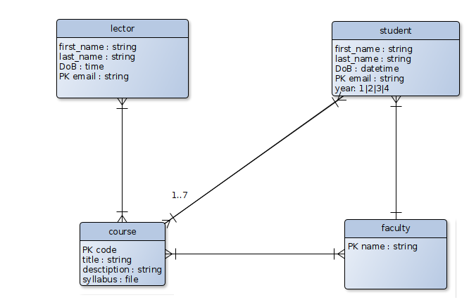

# Learning Management System (LMS)

## Description
This is a simple Learning Management System (LMS) that allows students to view their courses
and choose new courses to enroll in. But the following constraints are applied:
- Student should be registered to view the courses.
- Student should be authenticated to view the courses.
- The course is available for the faculty the student is enrolled in.
- The student can only take at most 7 courses.

At this point, the management of faculties, courses and
lecturers is completed by the 'administration'. 
The administration can add new faculties, courses and lecturers. 

## Detailed description
Here is a detailed description of the system
using crow notation:

